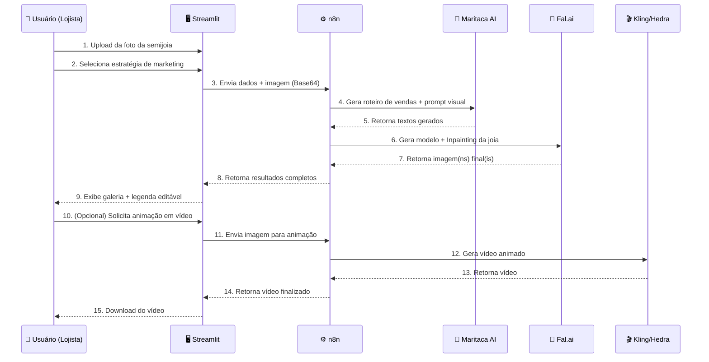

# 📄 DOCUMENTO MESTRE: GlowStudio AI (PRD + SKILLS)

> **Versão:** 2.0  
> **Data:** Abril de 2026  
> **Status:** Documento oficial de implementação  
> **Autor:** Equipe GlowStudio AI

---

## 1. Visão Geral do Produto

O **GlowStudio AI** é uma plataforma SaaS (Software as a Service) desenvolvida para o nicho de semijoias. O sistema permite que lojistas façam upload de fotos de suas peças reais e, através de Inteligência Artificial, "vistam" essas peças em modelos virtuais fotorrealistas, gerando legendas estratégicas e vídeos de divulgação.

### 1.1 Proposta de Valor

| Pilar | Descrição |
|-------|-----------|
| **Para quem** | Lojistas e revendedoras de semijoias no Brasil |
| **Problema** | Produção de conteúdo visual profissional é cara, demorada e exige modelos/fotógrafos |
| **Solução** | IA que gera modelos fotorrealistas vestindo as peças reais do lojista |
| **Diferencial** | Integração completa: foto → modelo com joia → legenda de venda → vídeo animado |

---

## 2. Protocolo de Segurança (Crítico)

### 2.1 Bloqueio de Ameaças Externas

- **🔒 Regra de Ouro:** É terminantemente proibido o uso de frameworks ou bibliotecas Python que não sejam as oficiais e consolidadas. Toda dependência DEVE ser validada antes da instalação.

- **🛡️ Proteção contra Typosquatting:** O sistema deve ser desenvolvido para evitar vulnerabilidades de "typosquatting" (bibliotecas falsas com nomes parecidos). Sempre verificar o nome exato do pacote no PyPI oficial antes de instalar.

- **🐳 Ambiente Isolado:** O desenvolvimento e deploy devem ocorrer em containers Docker isolados na VPS Hetzner.

### 2.2 Bibliotecas e Dependências Permitidas

> **IMPORTANTE:** Somente as bibliotecas listadas abaixo estão autorizadas para uso no projeto. Qualquer adição deve ser justificada e aprovada antes da implementação.

#### Bibliotecas Core (Obrigatórias)

| Biblioteca | Versão Mínima | Finalidade |
|------------|---------------|------------|
| `streamlit` | >= 1.45.x | Framework de interface/frontend |
| `requests` | >= 2.32.x | Chamadas HTTP para APIs externas (n8n) |
| `python-dotenv` | >= 1.1.x | Carregamento seguro de variáveis de ambiente |
| `Pillow` | >= 11.x | Manipulação e processamento de imagens |

#### Bibliotecas da Stdlib (Sempre Permitidas)

| Módulo | Finalidade |
|--------|------------|
| `base64` | Conversão de imagens para Base64 (envio para APIs) |
| `json` | Serialização/deserialização de payloads |
| `os` | Acesso a variáveis de ambiente e filesystem |
| `io` | Manipulação de streams de bytes (imagens em memória) |
| `pathlib` | Manipulação de caminhos de arquivos |
| `hashlib` | Geração de hashes para cache/identificadores |
| `uuid` | Geração de identificadores únicos |
| `logging` | Sistema de logs estruturado |
| `datetime` | Manipulação de datas e timestamps |
| `time` | Controle de timeouts e delays |
| `typing` | Type hints para código mais robusto |

#### Bibliotecas Opcionais (Aprovadas para uso futuro)

| Biblioteca | Versão | Finalidade | Fase |
|------------|--------|------------|------|
| `streamlit-authenticator` | >= 0.4.x | Autenticação de usuários | MVP |
| `supabase` | >= 2.x | Banco de dados e auth (se necessário) | V2 |
| `stripe` | >= 12.x | Processamento de pagamentos | V2 |
| `redis` | >= 5.x | Cache de sessões e rate limiting | V3 |

### 2.3 Checklist de Segurança para Novas Dependências

Antes de adicionar qualquer biblioteca ao `requirements.txt`:

1. ✅ Verificar se o nome **exato** existe no PyPI oficial (`https://pypi.org/project/<nome>`)
2. ✅ Conferir se tem mais de **1.000 downloads semanais**
3. ✅ Verificar se o repositório GitHub é **oficial e ativo**
4. ✅ Rodar `pip audit` para checar vulnerabilidades conhecidas
5. ✅ Documentar a justificativa no PR/commit

---

## 3. Stack Técnica

### 3.1 Tecnologias Principais

| Camada | Tecnologia | Versão | Justificativa |
|--------|-----------|--------|---------------|
| **Linguagem** | Python | 3.12+ | Ecossistema maduro para IA e automação |
| **Frontend** | Streamlit | 1.45+ | Prototipação rápida, foco em dados e IA |
| **Orquestração** | n8n | Self-hosted | Workflows visuais, integração com múltiplas APIs |
| **IA Texto** | Maritaca AI | API v1 | LLM brasileira, entende contexto cultural |
| **IA Imagem** | Fal.ai | API | Inpainting, geração de modelos, LoRA |
| **IA Vídeo** | Kling / Hedra | API | Animação de imagens estáticas |
| **Deploy** | Docker | 24.x+ | Containerização e isolamento |
| **VPS** | Hetzner | CPX31+ | Custo-benefício, datacenter EU |
| **Proxy** | Nginx | 1.24+ | Proxy reverso e load balancing |
| **SSL** | Certbot | Latest | Certificados Let's Encrypt gratuitos |

### 3.2 Versão do Python e Gerenciamento

```txt
# .python-version
3.12
```

```txt
# requirements.txt (versões fixas para reprodutibilidade)
streamlit==1.45.1
requests==2.32.3
python-dotenv==1.1.0
Pillow==11.1.0
```

---

## 4. Configuração de Ambiente

### 4.1 Estrutura do `.env`

```env
# ============================================
# GlowStudio AI - Variáveis de Ambiente
# ============================================

# --- Aplicação ---
APP_NAME=GlowStudio AI
APP_ENV=development          # development | staging | production
APP_DEBUG=true               # true | false
APP_PORT=8501
APP_SECRET_KEY=              # Chave secreta para sessões (gerar com: python -c "import secrets; print(secrets.token_hex(32))")

# --- n8n (Orquestrador de Workflows) ---
N8N_BASE_URL=http://localhost:5678
N8N_WEBHOOK_TEXT=            # URL do webhook de geração de texto (Maritaca AI)
N8N_WEBHOOK_IMAGE=           # URL do webhook de geração de imagem (Fal.ai)
N8N_WEBHOOK_VIDEO=           # URL do webhook de geração de vídeo (Kling/Hedra)
N8N_API_KEY=                 # API key para autenticação nos webhooks

# --- Maritaca AI (via n8n, backup direto) ---
MARITACA_API_KEY=            # Chave da API Maritaca AI
MARITACA_MODEL=sabia-3       # Modelo a ser utilizado

# --- Fal.ai (via n8n, backup direto) ---
FAL_API_KEY=                 # Chave da API Fal.ai

# --- Armazenamento ---
UPLOAD_MAX_SIZE_MB=10        # Tamanho máximo de upload em MB
UPLOAD_ALLOWED_EXTENSIONS=png,jpg,jpeg,webp

# --- Logs ---
LOG_LEVEL=INFO               # DEBUG | INFO | WARNING | ERROR | CRITICAL
```

### 4.2 Regras de Segurança para `.env`

> **⚠️ NUNCA** versionar o arquivo `.env` no Git. Apenas o `.env.example` (sem valores reais) deve ser commitado.

```gitignore
# .gitignore
.env
.env.local
.env.production
__pycache__/
*.pyc
.streamlit/secrets.toml
```

---

## 5. Arquitetura de Diretórios

```
GlowStudio AI/
│
├── 📄 GlowStudio_AI_Master.md      # Este documento (PRD + Skills)
├── 📄 README.md                     # Documentação pública do projeto
├── 📄 .env.example                  # Template de variáveis de ambiente
├── 📄 .gitignore                    # Exclusões do Git
├── 📄 requirements.txt              # Dependências Python (versões fixas)
├── 📄 Dockerfile                    # Build da imagem Docker
├── 📄 docker-compose.yml            # Orquestração de containers
├── 📄 nginx.conf                    # Configuração do Nginx (proxy reverso)
│
├── 📁 .streamlit/
│   └── config.toml                  # Configurações de tema do Streamlit
│
├── 📁 src/                          # Código-fonte principal
│   ├── 📄 app.py                    # Entry point do Streamlit (ponto de entrada)
│   │
│   ├── 📁 pages/                    # Telas/páginas do Streamlit
│   │   ├── 01_configuracao.py       # Tela 1: Configuração Estratégica
│   │   ├── 02_edicao.py             # Tela 2: Edição e Aprovação
│   │   └── 03_estudio.py            # Tela 3: Estúdio de Resultados
│   │
│   ├── 📁 services/                 # Camada de serviços (lógica de negócio)
│   │   ├── __init__.py
│   │   ├── n8n_client.py            # Cliente HTTP para comunicação com n8n
│   │   ├── image_processor.py       # Processamento de imagens (resize, base64)
│   │   └── session_manager.py       # Gerenciamento de st.session_state
│   │
│   ├── 📁 components/               # Componentes reutilizáveis de UI
│   │   ├── __init__.py
│   │   ├── header.py                # Header/navbar do app
│   │   ├── upload_widget.py         # Widget de upload estilizado
│   │   ├── gallery.py               # Galeria de imagens geradas
│   │   └── loading.py               # Animações de carregamento
│   │
│   ├── 📁 config/                   # Configurações e constantes
│   │   ├── __init__.py
│   │   ├── settings.py              # Carregamento do .env e constantes
│   │   └── theme.py                 # Cores, fontes e tokens de design
│   │
│   └── 📁 utils/                    # Utilitários gerais
│       ├── __init__.py
│       ├── validators.py            # Validação de inputs e arquivos
│       └── logger.py                # Configuração de logging
│
├── 📁 assets/                       # Arquivos estáticos
│   ├── 📁 images/                   # Logos, ícones, placeholders
│   └── 📁 css/                      # CSS customizado para Streamlit
│       └── style.css                # Estilos globais injetados via st.markdown
│
├── 📁 tests/                        # Testes automatizados
│   ├── __init__.py
│   ├── test_image_processor.py
│   ├── test_n8n_client.py
│   └── test_validators.py
│
└── 📁 docs/                         # Documentação adicional
    ├── api_contracts.md             # Contratos de API (n8n webhooks)
    └── deploy_guide.md              # Guia de deploy na Hetzner
```

---

## 6. PRD — Requisitos Funcionais (O que o sistema faz)

### 6.1 Fluxo de Trabalho (Workflow)



### 6.2 Detalhamento dos Passos

| Passo | Ação | Responsável | Entrada | Saída |
|-------|------|-------------|---------|-------|
| 1 | Upload da foto da semijoia | Usuário | Arquivo PNG/JPG (max 10MB) | Imagem armazenada em `session_state` |
| 2 | Seleção de estratégia de marketing | Usuário | Objetivo + Público + Diferenciais | Parâmetros de configuração |
| 3 | Envio para processamento | Streamlit | JSON com imagem em Base64 + parâmetros | Request HTTP para n8n |
| 4 | Geração de texto | n8n → Maritaca AI | Prompt formatado com contexto | Roteiro de vendas + prompt visual |
| 5-7 | Geração de imagem | n8n → Fal.ai | Prompt visual + imagem da joia | Imagem fotorrealista com a joia |
| 8-9 | Exibição de resultados | Streamlit | Dados de retorno do n8n | Galeria interativa |
| 10-15 | Animação em vídeo (opcional) | Pipeline completo | Imagem estática aprovada | Vídeo MP4 com movimento |

### 6.3 Detalhamento das Telas (Streamlit)

#### Tela 1: Configuração Estratégica

| Elemento | Tipo de Widget | Opções/Configuração |
|----------|---------------|---------------------|
| Upload de Foto | `st.file_uploader` | Aceita: PNG, JPG, JPEG, WEBP — Max: 10MB |
| Objetivo de Marketing | `st.selectbox` | Venda Direta, Autoridade, Lifestyle, Educativo |
| Público-Alvo | `st.selectbox` | Noivas, Executivas, Minimalistas, Presente |
| Diferenciais | `st.multiselect` | Banho 18k, Ródio, Hipoalergênico, Nanotecnologia |
| Preview da Imagem | `st.image` | Exibe preview da foto carregada |
| Botão Gerar | `st.button` | "✨ Gerar Conteúdo" — inicia o pipeline |

#### Tela 2: Edição e Aprovação

| Elemento | Tipo de Widget | Descrição |
|----------|---------------|-----------|
| Legenda Gerada | `st.text_area` | Editável — texto de vendas gerado pela Maritaca AI |
| Prompt Visual | `st.text_area` | Editável — prompt de imagem gerado pela Maritaca AI |
| Botão Regenerar Texto | `st.button` | Regenera apenas o texto sem reprocessar imagem |
| Botão Aprovar e Gerar Imagem | `st.button` | Envia prompt visual aprovado para geração via Fal.ai |

#### Tela 3: Estúdio de Resultados

| Elemento | Tipo de Widget | Descrição |
|----------|---------------|-----------|
| Galeria de Imagens | `st.columns` + `st.image` | Grid com todas as imagens geradas |
| Botão Download | `st.download_button` | Download individual de cada imagem (PNG) |
| Botão Animar | `st.button` | "🎬 Animar para Vídeo" — envia para Kling/Hedra |
| Player de Vídeo | `st.video` | Preview do vídeo gerado |
| Botão Download Vídeo | `st.download_button` | Download do vídeo final (MP4) |
| Legenda Final | `st.code` / `st.text_area` | Texto pronto para copiar e colar nas redes sociais |

### 6.4 Gerenciamento de Estado (`st.session_state`)

```python
# Estrutura do session_state
st.session_state = {
    # --- Tela 1: Configuração ---
    "uploaded_image": None,          # bytes da imagem original
    "uploaded_filename": "",         # nome do arquivo
    "objetivo": "",                  # objetivo de marketing selecionado
    "publico": "",                   # público-alvo selecionado
    "diferenciais": [],              # lista de diferenciais marcados
    
    # --- Tela 2: Edição ---
    "legenda_gerada": "",            # texto de vendas da Maritaca AI
    "prompt_visual": "",             # prompt de imagem da Maritaca AI
    "texto_aprovado": False,         # flag: usuário aprovou o texto?
    
    # --- Tela 3: Estúdio ---
    "imagens_geradas": [],           # lista de URLs/bytes das imagens
    "video_gerado": None,            # bytes do vídeo animado
    
    # --- Controle ---
    "etapa_atual": 1,                # controle de navegação (1, 2 ou 3)
    "processando": False,            # flag de loading
    "erros": [],                     # lista de erros para exibição
}
```

---

## 7. Definição das Skills Especialistas (System Prompts)

### 🖥️ Skill 1: UI/UX Streamlit (Frontend — Luxury Edition)

> **Prompt:** Atue como Desenvolvedor Frontend Sênior. Sua missão é construir a interface do **GlowStudio AI** na estética **Luxury Boutique**. Use uma identidade visual de alta joalheria (Silk Pearl/Nude Suave `#FAF8F5`, detalhes em Dourado Real `#D4AF37` e tipografia Serifada `Playfair Display`). Foque em `st.session_state` e Glassmorphism para criar uma experiência imersiva e preenchida, evitando espaços vazios.

**Responsabilidades:**
- Construir todas as telas seguindo os wireframes da Seção 6.3
- Implementar tema customizado via `.streamlit/config.toml` e CSS injetado
- Garantir UX fluida com animações de loading (`st.spinner`, `st.progress`)
- Manter separação clara: UI puxa dados de `services/`, nunca chama APIs diretamente

---

### 🔌 Skill 2: Integração e Backend (Python + n8n)

> **Prompt:** Atue como Engenheiro de Integração. Você é responsável por criar as funções que enviam os dados do GlowStudio AI para o n8n. Implemente conversão de imagem para Base64, tratamento de erros de conexão e garanta que o retorno do n8n seja exibido corretamente na interface.

**Responsabilidades:**
- Implementar `n8n_client.py` com retry logic e timeouts configuráveis
- Converter imagens para Base64 em `image_processor.py`
- Tratar erros HTTP (timeout, 500, 502) com mensagens amigáveis ao usuário
- Validar e parsear respostas JSON do n8n antes de mandar para a UI

**Contrato de API com n8n:**

```json
// POST para N8N_WEBHOOK_TEXT
{
  "image_base64": "data:image/png;base64,...",
  "objetivo": "Venda Direta",
  "publico": "Noivas",
  "diferenciais": ["Banho 18k", "Hipoalergênico"],
  "modelo_texto": "sabia-3"
}

// Resposta esperada
{
  "success": true,
  "legenda": "✨ Encontre o brilho perfeito para o seu grande dia...",
  "prompt_visual": "Elegant Brazilian model wearing a delicate 18k gold-plated..."
}
```

```json
// POST para N8N_WEBHOOK_IMAGE
{
  "image_base64": "data:image/png;base64,...",
  "prompt_visual": "Elegant Brazilian model wearing...",
  "num_images": 4
}

// Resposta esperada
{
  "success": true,
  "images": [
    { "url": "https://...", "seed": 12345 },
    { "url": "https://...", "seed": 67890 }
  ]
}
```

---

### 🧠 Skill 3: Estratégia e Copywriting (Maritaca AI)

> **Prompt:** Atue como Copywriter Sênior especializado no mercado brasileiro. Sua função é desenhar os prompts que serão enviados para a Maritaca AI dentro do n8n, garantindo textos persuasivos e prompts de imagem altamente técnicos para modelos de joias.

**Responsabilidades:**
- Criar templates de prompt para cada combinação de Objetivo × Público
- Garantir que o tom de voz do texto gerado seja sofisticado e persuasivo
- Gerar prompts visuais que resultem em imagens fotorrealistas e comerciais
- Incluir hashtags e CTAs (calls-to-action) nas legendas geradas

---

### 🎨 Skill 4: Engenharia de Mídia (Fal.ai / Kling / Hedra)

> **Prompt:** Atue como Especialista em IA Generativa. Você deve configurar os parâmetros de Inpainting e LoRA para que a joia real do usuário seja mesclada com perfeição fotorrealista à modelo gerada. Configure também os parâmetros de saída para vídeos de alta qualidade.

**Responsabilidades:**
- Definir parâmetros ótimos de Inpainting (strength, guidance scale, steps)
- Configurar LoRA weights para consistência de estilo
- Garantir que a joia real mantenha detalhes (brilho, textura, cor) na fusão
- Configurar output de vídeo: resolução, FPS, duração, codec

---

### ⚙️ Skill 5: Infraestrutura e DevOps (Hetzner + Docker)

> **Prompt:** Atue como Engenheiro de DevOps. Sua missão é guiar o deploy do GlowStudio AI na Hetzner usando Docker. Configure Nginx como proxy reverso, SSL (Certbot) e garanta que o ambiente Python esteja blindado contra scripts maliciosos.

**Responsabilidades:**
- Criar `Dockerfile` otimizado (multi-stage build, non-root user)
- Configurar `docker-compose.yml` com health checks
- Implementar Nginx como proxy reverso com rate limiting
- Configurar SSL via Certbot com auto-renovação
- Implementar backup automatizado de dados

---

## 8. Requisitos Não-Funcionais (NFRs)

### 8.1 Performance

| Métrica | Meta | Medição |
|---------|------|---------|
| Tempo de carregamento da UI | < 2 segundos | Lighthouse / browser |
| Tempo de geração de texto (Maritaca AI) | < 15 segundos | Logs do n8n |
| Tempo de geração de imagem (Fal.ai) | < 60 segundos | Logs do n8n |
| Tempo de geração de vídeo (Kling/Hedra) | < 120 segundos | Logs do n8n |
| Upload máximo de imagem | 10 MB | Validação no frontend |

### 8.2 Disponibilidade e Escalabilidade

| Requisito | Meta |
|-----------|------|
| Uptime | 99.5% (excluindo manutenção programada) |
| Usuários simultâneos (MVP) | Até 50 |
| Usuários simultâneos (V2) | Até 500 |
| Recovery Time | < 30 minutos |

### 8.3 Segurança

| Requisito | Implementação |
|-----------|---------------|
| Dados em trânsito | HTTPS/TLS 1.3 obrigatório |
| API Keys | Armazenadas em `.env`, nunca no código |
| Upload de arquivos | Validação de tipo MIME + extensão + tamanho |
| Container | Non-root user, sem capabilities extras |
| Rate limiting | Nginx: max 30 req/min por IP |

---

## 9. Autenticação e Multi-tenancy (Roadmap)

### 9.1 MVP (Sem autenticação)

- Acesso direto à aplicação sem login
- Ideal para validação inicial e testes com primeiros clientes
- Dados de sessão perdidos ao fechar o browser

### 9.2 V2 (Autenticação básica)

- Login com email/senha via `streamlit-authenticator`
- Cada usuário tem um histórico de gerações
- Limite de gerações por plano (ver Seção 10)

### 9.3 V3 (Multi-tenancy completo)

- Integração com Supabase Auth (social login, magic link)
- Dashboard administrativo por tenant
- Isolamento completo de dados entre tenants
- API de billing integrada (Stripe)

---

## 10. Planos e Monetização (SaaS)

| Plano | Preço Mensal | Gerações de Imagem | Gerações de Vídeo | Suporte |
|-------|-------------|--------------------|--------------------|---------|
| **Starter** | R$ 49,90 | 30/mês | 5/mês | Email |
| **Pro** | R$ 99,90 | 100/mês | 20/mês | Email + Chat |
| **Business** | R$ 199,90 | Ilimitado | 50/mês | Prioritário |

> **Nota:** Os planos e preços são estimativas iniciais. Serão validados com pesquisa de mercado antes do lançamento. A implementação do billing está prevista para a fase V2.

---

## 11. Roadmap de Desenvolvimento

### Fase 1 — MVP (Semanas 1-4)

| Semana | Entregável | Skills |
|--------|-----------|--------|
| 1 | Setup do projeto + Estrutura de diretórios + Docker base + Tema Streamlit | Skill 1, 5 |
| 2 | Tela 1 (Configuração) + Tela 2 (Edição) completas | Skill 1 |
| 3 | Integração com n8n + Maritaca AI + Fal.ai funcional | Skill 2, 3, 4 |
| 4 | Tela 3 (Estúdio) + Deploy na Hetzner + Testes end-to-end | Skill 1, 4, 5 |

**Critérios de conclusão do MVP:**
- ✅ Usuário consegue fazer upload → gerar legenda → gerar imagem → download
- ✅ Deploy funcional na Hetzner com SSL
- ✅ Pipeline n8n operacional com tratamento de erros

### Fase 2 — Autenticação + Monetização (Semanas 5-8)

- Login de usuários
- Histórico de gerações salvo
- Integração com gateway de pagamento
- Dashboard de uso (quantidade de gerações restantes)

### Fase 3 — Escala e Otimização (Semanas 9-12)

- Cache de respostas da Maritaca AI
- Fila de processamento para alta demanda
- Painel administrativo
- Analytics de uso

---

## 12. Identidade Visual (Design Tokens)

### 12.1 Paleta de Cores (Luxury Boutique Edition)

| Token | Cor | Hex | Uso |
|-------|-----|-----|-----|
| `--primary` | Dourado Real | `#D4AF37` | Botões, icones ativos, branding |
| `--primary-dark` | Ouro Envelhecido | `#B08D26` | Hover states, detalhes de luxo |
| `--accent-champagne`| Champagne | `#F5E6D3` | Divisores, fundos secundários |
| `--bg-dark` | Silk Pearl | `#FAF8F5` | Background principal (texturizado) |
| `--bg-card` | Pure White | `#FFFFFF` | Cards com Glassmorphism |
| `--text-primary` | Coal Black | `#1A1A1A` | Títulos e texto principal |
| `--text-secondary` | Deep Gray | `#3D3D3D` | Texto secundário e legendas |
| `--success` | Emerald | `#27AE60` | Feedback de sucesso |
| `--error` | Ruby | `#C0392B` | Feedback de erro |
| `--warning` | Amber | `#D35400` | Alertas e avisos |

### 12.2 Tipografia

| Uso | Fonte | Fallback |
|-----|-------|----------|
| Headings | `Playfair Display` | `serif` |
| Body | `Inter` | `system-ui, sans-serif` |
| Código | `JetBrains Mono` | `monospace` |

### 12.3 Streamlit Theme (`.streamlit/config.toml`)

```toml
[theme]
primaryColor = "#D4AF37"
backgroundColor = "#FAF8F5"
secondaryBackgroundColor = "#FFFFFF"
textColor = "#1A1A1A"
font = "serif"
```

---

## 13. Fluxo de Dados — Diagrama de Arquitetura

```
┌─────────────────────────────────────────────────────────────────┐
│                        USUÁRIO (Browser)                        │
└─────────────────────┬───────────────────────────────────────────┘
                      │ HTTPS (porta 443)
                      ▼
┌─────────────────────────────────────────────────────────────────┐
│                     NGINX (Proxy Reverso)                       │
│                 Rate Limiting + SSL Termination                  │
└─────────────────────┬───────────────────────────────────────────┘
                      │ HTTP (porta 8501)
                      ▼
┌─────────────────────────────────────────────────────────────────┐
│                STREAMLIT APP (Container Docker)                  │
│  ┌──────────┐  ┌──────────┐  ┌──────────┐                      │
│  │  Tela 1  │→ │  Tela 2  │→ │  Tela 3  │  (st.session_state) │
│  └──────────┘  └──────────┘  └──────────┘                      │
│         │              │              │                          │
│         └──────────────┼──────────────┘                          │
│                        │                                         │
│              ┌─────────▼─────────┐                               │
│              │   services/       │                               │
│              │   n8n_client.py   │                               │
│              └─────────┬─────────┘                               │
└────────────────────────┼────────────────────────────────────────┘
                         │ HTTP POST (webhooks)
                         ▼
┌─────────────────────────────────────────────────────────────────┐
│                    n8n (Container Docker)                        │
│                                                                  │
│  ┌──────────────┐  ┌──────────────┐  ┌──────────────┐          │
│  │ Workflow      │  │ Workflow      │  │ Workflow      │          │
│  │ Texto         │  │ Imagem        │  │ Vídeo         │          │
│  │ (Maritaca AI) │  │ (Fal.ai)      │  │ (Kling/Hedra) │          │
│  └──────┬───────┘  └──────┬───────┘  └──────┬───────┘          │
└─────────┼──────────────────┼──────────────────┼─────────────────┘
          │                  │                  │
          ▼                  ▼                  ▼
   ┌────────────┐    ┌────────────┐    ┌────────────┐
   │ Maritaca AI │    │   Fal.ai   │    │Kling/Hedra │
   │   (API)     │    │   (API)    │    │   (API)    │
   └────────────┘    └────────────┘    └────────────┘
```

---

*Documento gerado para a implementação oficial do GlowStudio AI — Abril de 2026.*  
*Versão 2.0 — Convertido e expandido a partir do documento original.*